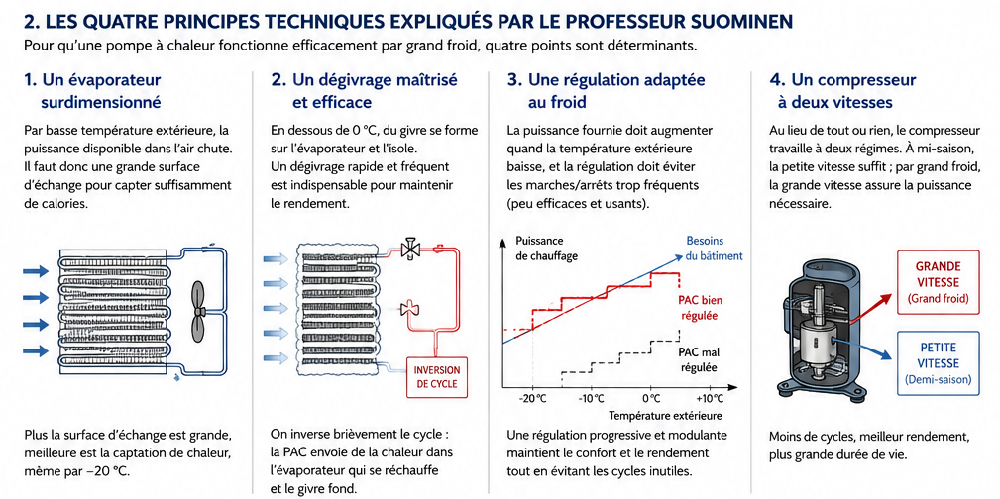

## Introduction

Les échecs du programme PERCHE n'étaient pas dus à une faille dans la thermodynamique des pompes à chaleur. Ils résultaient de quatre problèmes d'ingénierie précis, que le professeur Suominen avait identifiés et résolus dès le début des années 1980 — pendant que la France tirait des conclusions hâtives sur l'ensemble de la technologie.

Ces quatre principes forment un système cohérent : chacun répond à un défaut spécifique des machines de l'époque, et ensemble ils définissent ce qu'est une pompe à chaleur efficace par grand froid. Quarante ans plus tard, ils sont devenus les fondements de toute l'industrie mondiale.

*Illustration des quatre principes identifiés par le professeur Suominen pour une pompe à chaleur performante par grand froid. Illustration créée pour ce projet.*

---

## Principe 1 — Un évaporateur surdimensionné

### Ce que Suominen préconisait

Par basse température extérieure, la puissance disponible dans l'air chute. L'air froid contient moins d'énergie thermique par unité de volume, et l'évaporateur — le composant qui extrait cette énergie — doit compenser cette raréfaction par une surface d'échange plus grande.

Les machines françaises de l'époque étaient dimensionnées pour fonctionner dans une plage de +5 °C à +15 °C. En dessous, leur évaporateur devenait insuffisant : la machine « manquait d'air » thermiquement, son COP[^1] s'effondrait et elle se mettait en sécurité.

Suominen préconisait au contraire de dimensionner l'évaporateur pour les conditions les plus défavorables — c'est-à-dire pour −20 °C — quitte à ce qu'il soit surdimensionné à température douce. Un évaporateur généreux à +10 °C est simplement très efficace ; le même évaporateur étrique à −20 °C est une machine inutilisable.

### L'évolution jusqu'à aujourd'hui

Le principe est resté, mais les moyens ont considérablement évolué :

- **Géométrie des ailettes** : les évaporateurs modernes utilisent des ailettes à pas variable, des surfaces microstructurées et des géométries hélicoïdales qui maximisent l'échange thermique sans augmenter excessivement le volume.
- **Ventilateurs à débit variable** : couplés à un moteur EC (à commutation électronique), ils adaptent le débit d'air à la température extérieure, optimisant en permanence l'échange sans surconsommation.
- **Fluides frigorigènes adaptés** : les réfrigérants modernes (R32, R290) ont de meilleures propriétés thermodynamiques à basse température que le R22 utilisé dans les années 1980, ce qui améliore l'efficacité de l'échange même sur des surfaces comparables.

> **En résumé** : Suominen avait raison sur le principe — plus de surface d'échange. L'industrie y a ajouté quarante ans d'optimisation aérodynamique et thermodynamique.

---

## Principe 2 — Un dégivrage maîtrisé et efficace

### Ce que Suominen préconisait

En dessous de 0 °C, la vapeur d'eau contenue dans l'air se dépose sur l'évaporateur et gèle. Cette couche de givre est un isolant thermique : elle réduit progressivement l'échange entre l'air et le réfrigérant, dégradant le COP jusqu'à rendre la machine inefficace.

Le dégivrage est donc inévitable — mais il a un coût énergétique. Pendant la phase de dégivrage, la pompe à chaleur n'assure plus le chauffage ; elle consomme de l'énergie pour se réchauffer elle-même. Un dégivrage mal géré peut annuler une grande partie des gains obtenus par ailleurs.

La solution préconisée par Suominen repose sur l'**inversion de cycle** : on bascule brièvement la machine en mode climatisation, ce qui envoie le réfrigérant chaud dans l'évaporateur. Le givre fond rapidement, et la machine reprend son fonctionnement normal en quelques minutes. Ce dégivrage doit être déclenché au bon moment — ni trop tôt (inutile), ni trop tard (la couche de givre est trop épaisse).

### L'évolution jusqu'à aujourd'hui

L'inversion de cycle est restée la méthode de référence, mais sa gestion est devenue beaucoup plus intelligente :

- **Dégivrage à la demande** : les machines modernes ne dégivrent plus selon un minuteur fixe, mais selon des capteurs mesurant la pression différentielle ou la température de l'évaporateur. Le dégivrage n'est déclenché que lorsqu'il est réellement nécessaire.
- **Dégivrage par injection de gaz chaud** (*hot gas bypass*) : dans certains systèmes, on injecte directement du réfrigérant chaud côté évaporateur sans inverser le cycle complet, ce qui réduit l'interruption de chauffage.
- **Algorithmes prédictifs** : les PAC haut de gamme actuelles intègrent des modèles qui anticipent l'encrassement par givre en fonction de l'hygrométrie et de la température extérieure, et optimisent la fréquence des cycles.
- **Résistances d'appoint ciblées** : certains modèles combinent l'inversion de cycle avec un chauffage électrique localisé sur les points les plus sensibles (bac de collecte, tuyauteries), réduisant la durée du cycle.

> **En résumé** : Suominen avait posé le bon principe — dégivrer vite et au bon moment par inversion de cycle. L'industrie a transformé cette intuition en systèmes de contrôle sophistiqués qui minimisent les pertes énergétiques liées au dégivrage.

---

## Principe 3 — Une régulation adaptée au froid

### Ce que Suominen préconisait

Une pompe à chaleur à régulation tout-ou-rien — qui s'arrête quand la température de consigne est atteinte et repart quand elle chute — présente deux défauts majeurs par grand froid :

- **Les cycles courts** : la machine s'arrête et repart fréquemment, ce qui est mécaniquement usant et thermodynamiquement inefficace (chaque démarrage consomme une pointe d'énergie sans produire immédiatement de chaleur utile).
- **Le désaccord puissance/besoins** : à −20 °C, les besoins du bâtiment sont maximaux, mais une machine à puissance fixe calée sur +5 °C peut être incapable de les couvrir — ou, à l'inverse, trop puissante à +10 °C et donc en cycles permanents.

Suominen préconisait une régulation *modulante* : la puissance de la machine doit suivre en continu les besoins du bâtiment, en fonction de la température extérieure. Le graphique de l'article original montre très clairement la différence entre une PAC bien régulée — dont la puissance suit la courbe des besoins — et une PAC mal régulée, dont la puissance en escalier génère des cycles incessants et un confort médiocre.

### L'évolution jusqu'à aujourd'hui

C'est probablement le domaine où l'évolution technologique a été la plus spectaculaire depuis les années 1980 :

- **Régulation par courbe climatique** : la température de départ du circuit de chauffage est calculée en continu en fonction de la température extérieure, selon une courbe paramétrable. La machine anticipe les besoins au lieu de réagir après coup.
- **Compresseur Inverter** (voir principe 4) : il rend possible la modulation de puissance en continu, ce qui était techniquement impossible avec un compresseur à vitesse fixe.
- **Intégration domotique** : les PAC modernes communiquent avec des thermostats connectés, des sondes extérieures, voire des prévisions météorologiques, pour optimiser leur fonctionnement sur des horizons de plusieurs heures.
- **Détection de présence et apprentissage** : certains systèmes adaptent leur régulation aux habitudes d'occupation du logement, réduisant la consommation en l'absence des occupants sans compromettre le confort au retour.

> **En résumé** : Suominen avait décrit le comportement idéal — une puissance modulante qui suit les besoins. L'électronique de puissance et l'informatique embarquée ont rendu ce comportement non seulement possible, mais standard.

---

## Principe 4 — Un compresseur à deux vitesses

### Ce que Suominen préconisait

Au lieu du traditionnel fonctionnement tout-ou-rien, Suominen préconisait un compresseur capable de travailler à **deux régimes distincts** :

- **Petite vitesse** en demi-saison, lorsque les besoins sont modérés et la température extérieure encore positive : la machine tourne en continu à faible puissance, ce qui est thermodynamiquement bien plus efficace qu'une succession de démarrages à pleine charge.
- **Grande vitesse** par grand froid, lorsque les besoins maximaux doivent être couverts malgré une température extérieure très basse.

Ce principe apparaît simple, mais il représentait une rupture conceptuelle importante à l'époque : il admettait qu'une pompe à chaleur ne pouvait pas être optimisée pour un seul point de fonctionnement. Elle devait être conçue pour une *plage* de conditions.

### L'évolution jusqu'à aujourd'hui

Le compresseur à deux vitesses de Suominen était une première étape. L'industrie est allée bien plus loin :

- **Compresseur Inverter** (fin des années 1990) : grâce à un variateur de fréquence électronique, la vitesse du compresseur devient *continue* et non plus binaire. La machine peut fonctionner à 30 %, 60 %, 100 % de sa puissance nominale — et tout point intermédiaire. Le COP est maximisé à chaque instant.
- **Compresseur scroll** : devenu dominant dans les années 2000, il offre un meilleur rendement volumétrique que le compresseur à piston utilisé dans les années 1980, une moindre usure mécanique et un fonctionnement plus silencieux.
- **Compresseur rotatif double** : utilisé dans les splits de haute performance, il réduit encore les vibrations et améliore l'efficacité aux faibles charges.
- **Injection de vapeur** (*vapor injection*) : technique avancée qui injecte du réfrigérant supplémentaire dans le compresseur à mi-compression, augmentant significativement la puissance disponible à très basse température (jusqu'à −25 °C et au-delà) sans surdimensionner le compresseur.

> **En résumé** : Suominen avait posé le principe fondamental — la puissance variable est indispensable. L'électronique de puissance a transformé ce principe en modulation continue, rendant obsolète la notion même de « vitesse fixe ».

---

## Conclusion — Une vision cohérente, une réalisation progressive

Ce qui frappe à la relecture des travaux de Suominen, c'est leur cohérence systémique. Les quatre principes ne sont pas quatre recettes indépendantes : ils forment un tout. Un évaporateur surdimensionné n'a de sens que si le dégivrage est efficace. Une régulation modulante n'est possible que si le compresseur peut varier sa puissance. Et l'ensemble ne fonctionne correctement que si la régulation est capable de piloter le compresseur en fonction des conditions extérieures réelles.

Suominen avait décrit, dès le début des années 1980, l'architecture d'une pompe à chaleur moderne. Ce qui lui manquait — et ce que quarante ans de progrès technologique ont apporté — c'est l'électronique de puissance abordable, les nouveaux fluides frigorigènes, les matériaux d'échange thermique optimisés et les microcontrôleurs capables de piloter tout cela en temps réel.

L'idée était juste. La technologie a simplement mis quarante ans à la rattraper.

[^1]: **COP** (*Coefficient of Performance*) : rapport entre l'énergie thermique fournie et l'énergie électrique consommée. Un COP de 3 signifie que pour 1 kWh électrique consommé, la machine produit 3 kWh de chaleur. Par grand froid, le COP des machines mal conçues s'effondre parfois en dessous de 1 — moins efficaces qu'un simple radiateur électrique.
